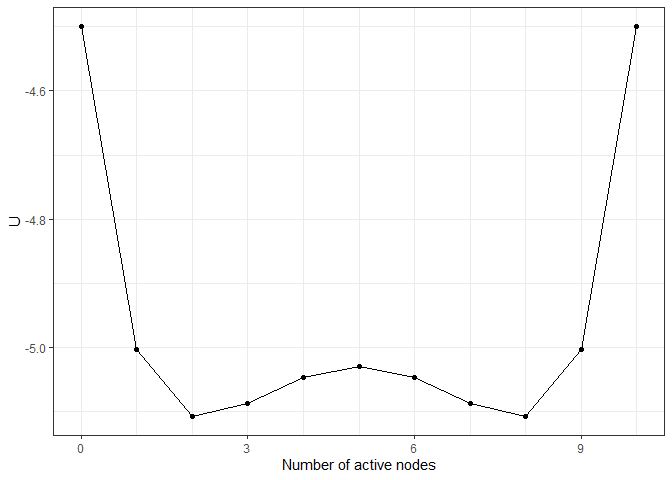

<!-- README.md is generated from README.Rmd. Please edit that file -->

# Isinglandr 

<!-- badges: start -->
<!-- badges: end -->

The goal of Isinglandr is to …

## Installation

You can install the development version of Isinglandr from
[GitHub](https://github.com/) with:

``` r
# install.packages("devtools")
devtools::install_github("Sciurus365/Isinglandr")
```

## Example

### Landscape construction

``` r
library(Isinglandr)
#  A toy network and its landscape
Nvar <- 10
m <- rep(0, Nvar)
w <- matrix(0.1, Nvar, Nvar)
diag(w) <- 0

result1 <- make_2d_Isingland(m, w)
plot(result1)
```



``` r
## What if the network becomes denser?
result2 <- make_2d_Isingland(m, 1.5 * w)
plot(result2)
```


``` r
## What if the thresholds become lower?
result3 <- make_2d_Isingland(m - 0.5, w)
plot(result3)
```


``` r
## Multiple networks together
result4 <- make_Ising_grid(
  all_thresholds(seq(0.8, 1.2, 0.2)),
  whole_weiadj(seq(0.8, 1.2, 0.2)),
  m, w
) %>% make_2d_Isingland_matrix()
plot(result4)
```


### Simulation on landscapes

``` r
sim1 <- simulate_2d_Isingland(result1, initial = 5)
plot(sim1)
```


``` r
sim4 <- simulate_2d_Isingland_matrix(result4, initial = 5)
plot(sim4)
```


