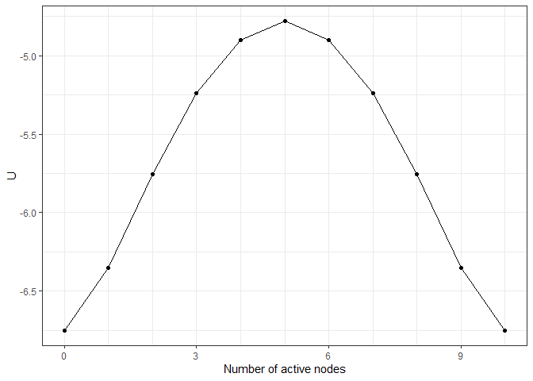
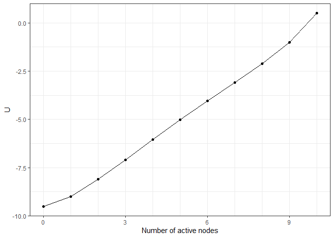
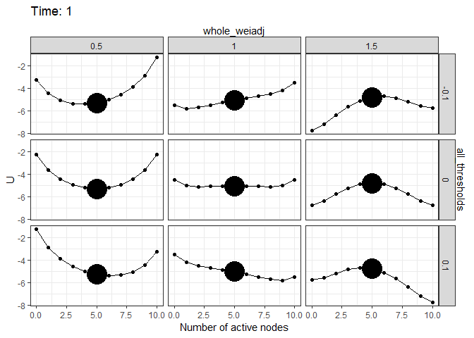

<!-- README.md is generated from README.Rmd. Please edit that file -->

# `Isinglandr`: Landscape Construction and Simulation for Ising Networks 

<!-- badges: start -->

[](https://CRAN.R-project.org/package=Isinglandr)

[](https://cran.r-project.org/package=Isinglandr)
[](https://github.com/Sciurus365/Isinglandr/actions/workflows/R-CMD-check.yaml)
<!-- badges: end -->

A toolbox for constructing potential landscapes for Ising networks. The
parameters of the networks can be directly supplied by users or
estimated by the `IsingFit` package by van Borkulo and Epskamp (2016)
<https://CRAN.R-project.org/package=IsingFit> from empirical data. The
Ising model’s Boltzmann distribution is preserved for the potential
landscape function. The landscape functions can be used for quantifying
and visualizing the stability of network states, as well as visualizing
the simulation process.

## Installation

You can install the development version of Isinglandr from
[GitHub](https://github.com/) with:

``` r
# install.packages("devtools")
devtools::install_github("Sciurus365/Isinglandr")
```

## Example

### Landscape construction

``` r
library(Isinglandr)
#> Registered S3 method overwritten by 'Isinglandr':
#>   method          from    
#>   print.landscape simlandr
#  A toy network and its landscape
Nvar <- 10
m <- rep(0, Nvar)
w <- matrix(0.1, Nvar, Nvar)
diag(w) <- 0

result1 <- make_2d_Isingland(m, w)
plot(result1)
```


``` r

## What if the network becomes denser?
result2 <- make_2d_Isingland(m, 1.5 * w)
plot(result2)
```



``` r

## What if the thresholds become lower?
result3 <- make_2d_Isingland(m - 0.5, w)
plot(result3)
```



``` r

## Multiple networks together
result4 <- make_Ising_grid(
  all_thresholds(seq(-0.1, 0.1, 0.1), .f = `+`),
  whole_weiadj(seq(0.5, 1.5, 0.5)),
  m, w
) %>% make_2d_Isingland_matrix()
plot(result4)
#> Scale for x is already present.
#> Adding another scale for x, which will replace the existing scale.
```


### Simulation on landscapes

``` r
set.seed(1614)
sim1 <- simulate_Isingland(result1, initial = 5)
plot(sim1)
```


``` r

set.seed(1614)
sim4 <- simulate_Isingland(result4, initial = 5)
plot(sim4)
```



## Shiny app

A shiny app is included in this package to show the landscape for the
Ising network of major depressive disorder. The network parameters can
be manipulated to see how they influence the landscape and the
simulation. Run `shiny_Isingland_MDD()` to start it.
